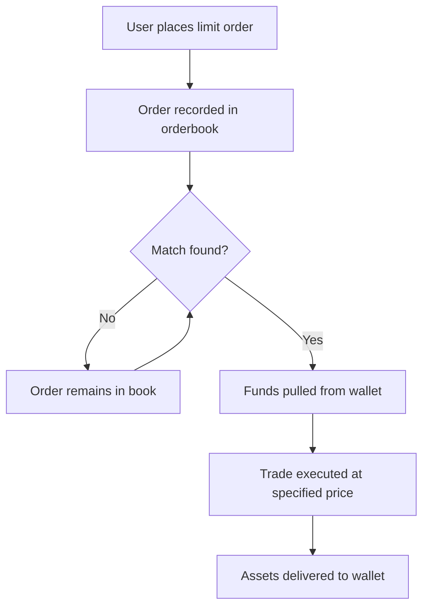

# Orderbook and Limit Orders

In Mach Exchange, users can place limit orders directly through the protocol. These orders are recorded in the orderbook and matched with corresponding buy or sell orders as market conditions meet the specified criteria. This system ensures that trades are executed efficiently and transparently.

## Understanding the Orderbook

An orderbook is a real-time database of all open orders across the Mach protocol. It contains:

1. **Buy Orders (Bids)**: Orders to purchase assets at a specific price or better
2. **Sell Orders (Asks)**: Orders to sell assets at a specific price or better
3. **Order Details**: Information such as asset pairs, volumes, prices, and timestamps

The orderbook serves as the central matching mechanism for all trades on the platform, ensuring fair and efficient price discovery.

## Limit Orders in Mach

Limit orders allow users to specify the exact price at which they are willing to buy or sell an asset. Key features of Mach's limit order system include:

- **Cross-Chain Capability**: Place limit orders that execute across different blockchains
- **Price Control**: Set precise price points for execution, ensuring you never pay more than your specified price
- **No Pre-funding**: Funds remain in your wallet until the order is ready to execute
- **Efficient Matching**: Orders are matched in real-time as market conditions change

## How Limit Orders Work

1. **Order Placement**: Users sign a transaction that grants the smart contract permission to interact with their assets at a specific price point
2. **Orderbook Entry**: The order is recorded in the orderbook without moving funds
3. **Match Finding**: The protocol continuously searches for matching orders
4. **Execution**: When a match is found at or better than the specified price, the funds are pulled and the swap is executed
5. **Settlement**: The entire process is completed in a single block once matched

## Benefits of the Limit Order System

Mach's limit order system provides several advantages:

- **User Control**: Users have precise control over execution prices
- **Reduced Slippage**: Avoid price impact by setting exact execution parameters
- **Passive Trading**: Set your desired price and let the market come to you
- **Capital Efficiency**: No need to lock up funds until execution
- **Cross-Chain Flexibility**: Execute limit orders across any supported blockchain network

## Trade Flow Example

By leveraging limit orders on Mach Exchange, users can execute sophisticated trading strategies across blockchain networks while maintaining complete control over their trading parameters and assets.
