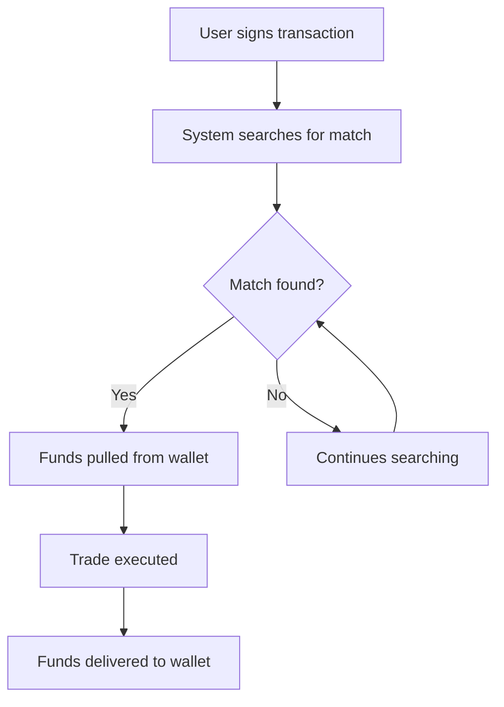

# Placing a Trade

When you place a trade on Mach, **your funds remain in your wallet until a match is found**.

## How It Works

1. **Sign Permission**: Users first sign a transaction that grants the smart contract permissions to interact with your asset. None of these assets are moved during this initial step.

   

2. **Match Finding**: After signing the transaction, the system begins searching for the best possible match.

   

3. **Execution**: Once a match is found, the funds are pulled and paid out in tight succession.

   
   
   Smart Contract pulls funds

   
   
   Smart Contract pays out funds

4. **Settlement**: The entire swap is processed **in just one block**, providing near-instant settlement.

## Key Benefits

- **Secure**: Your funds stay in your wallet until the trade is ready to execute
- **Efficient**: No need to pre-deposit funds into a separate contract or pool
- **Fast**: Trades complete in a single block once a match is found
- **Low Cost**: Optimized execution minimizes gas fees

## Trade Flow Diagram

